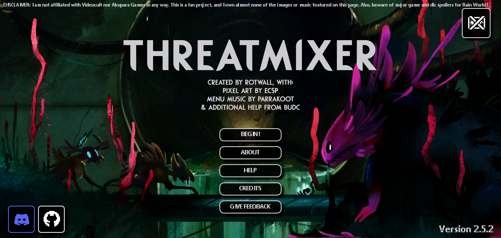
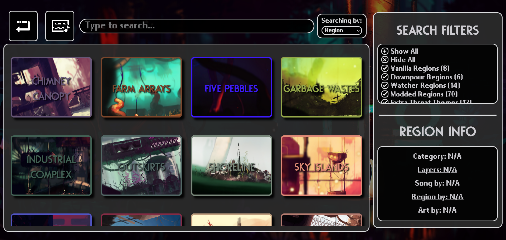
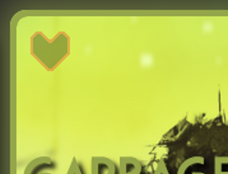
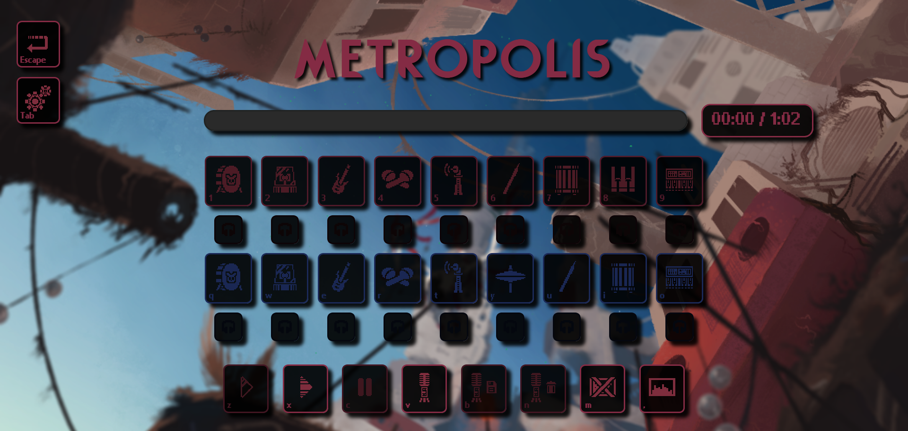
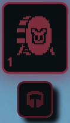
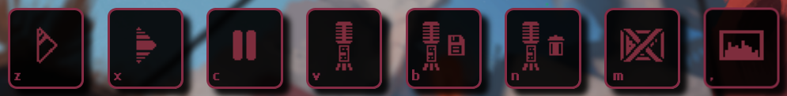
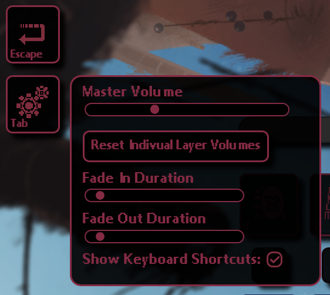

# *Known Issues*

## Mixes missing metadata

When exporting a mix from Google Chrome, Microsoft Edge, or really (to my knowledge) any other web browser aside from Firefox, the resulting audio file will likely be in the .webm format and won't have any metadata. This means that you likely won't be able to control the file's playback in your device's media player nor edit it in an audio/video editing software. To convert these files to a different format and restore the metadata, I recommend that you use a file converter like [Cloud Convert](https://cloudconvert.com/).

# *Guide (as of 2.6.0)*

Welcome to Threatmixer! Here, we'll go over the basics of how to use the webpage.

Upon first opening the page, you'll be presented with the home screen. Take a second to admire the names behind the project before selecting from the five options beneath the title:
- **BEGIN!**: Takes you out of the home screen and into the selection screen.
- **ABOUT**: Displays general info about the project as well as the changelog for the current version.
- **HELP**: Where you are now.
- **CREDITS**: Self-explanatory. Library liscenses are also detailed here.
- **GIVE FEEDBACK**: Opens up a Google form in another tab where you can submit any comments and suggestions.

You'll also notice some buttons in the corner of the screen. In the bottom left, the blue button leads to our official Discord server and the white one leads to the webpage's Github repository. Click the button in the top right of the screen to hear some wonderful menu music made by Parrakoot!

Once you're done looking around, hit the BEGIN button to enter the selection screen and start hearing some threat themes.

## The Selection Screen

Here, you can peruse the webpage's huge catalogue of songs, all from Rain World's original soundtrack alongside fan-made ones from the community. 

Simply scroll through the buttons labeled with region names until you find something you want to listen to. If you're on a computer, hover over a region button to hear a small preview of the full song! While hovering, you can also look towards the bottom right of the screen to see some more information on the song, including who made it, what region it's for, and what category it belongs to.

These categories alongside the search bar and filter options make it easy to find exact songs. The search bar allows you to search for songs by the region name, artist name, or region acronym (for those that know them). Simply type where it prompts you to and the catalogue will automatically only show what fits your query. You can then further narrow down your search with the additional filters in the top right. Toggle which categories of songs you wish to see by using the checkboxes.

Also, while hovering over a button, you may have noticed a little heart appear:

By clicking it, you'd have set the current song as one of your favorites. Favorited songs get put into their own special category so you can easily find them later. The webpage will remember which regions you selected as favorites by storing the information within your browser's local storage.

Lastly, the two buttons in the top left of the screen and the exit and preview toggle buttons. They will both bring you back to the home screen and prevent song previews from playing respectively.

Now that you can nagivate the selection screen, it's time to choose a threat theme and get mixing.

## The Music Screen

Let's say you chose Metropolis because you have incredible taste. You'll then be greeted with this:

There's lots of things to go over here, so bear with me as I walk you through it all. Let's go over the **layer buttons** first.

These are what are right in the middle of the screen and have special icons typically representing sounds/instruments. Each layer button corresponds with a different layer of the threat theme. You can see the name of said layer by hovering over the button. Simply click these buttons to either play or mute specific sounds. These would then all come together to form the complete song. Rather than clicking, you could also activate a button by pressing its assigned key on your keyboard.

Below each layer button is what's called a **solo button**. As the name implies, it will solo out its corresponding layer once pressed, muting all others which were playing beforehand. Pressing the button again will un-solo the song, unmuting the other sounds which were originally playing. To activate them with a keyboard, simply hold shift and press the corresponding layer button's key (for example, to solo out the kick, you'd hit shift + 1).

Furthermore, layer buttons will sometimes have different colors despite being from the same region. This is usually to denote subregions, certain layers that aren't meant to be heard together in-game, or other such special cases.

Now, let's cover the **control buttons**.

Here's how they function from left to right:
- **Start Button**: Begins the song with your selected layers.
- **Play/End All Button**: Begins the song with every layer unmuted. Ends the song if it is currently playing.
- **Pause Button**: Pauses the song. Pauses recordings as well.
- **Record Button**: Begins a recording.
- **Save Button**: Brings up a prompt to name and save the recording to your downloads.
- **Delete Button**: Discards the current recording.
- **Fade Toggle**: Enables/disables fading in/out layers. All layers will become fadable when enabled.
- **Visualizer Toggle**: Hides/shows the visualizer.

Pretty simple, right? The settings button in the top left also provides some greater control over your mix and the music screen as a whole:

These options should be pretty self-explanatory, but I will go over the "Reset Individual Layer Volumes" quickly. When hovering over a layer button, a volume slider will appear which allows you to alter how loud that specific layer is. When you click the volume reset button, it does what it says it will for every layer.

Last but not least, the exit button above the settings button will take you back to the selection screen once ready.

...And that's all! As the webpage gains more features and becomes more complex over time, this guide will reflect such. I hope you have an easy and fun time exploring what Threatmixer has to offer. Now stop reading and go listen to some music!