# *Known Issues*

## Mixes missing metadata

When exporting a mix from Google Chrome, Microsoft Edge, or really (to my knowledge) any other web browser aside from Firefox, the resulting audio file will likely be in the .webm format and won't have any metadata. This means that you likely won't be able to control the file's playback in your device's media player nor edit it in an audio/video editing software. To convert these files to a different format and restore the metadata, I recommend that you use a file converter like [Cloud Convert](https://cloudconvert.com/).

## Music screen refusing to load

Issues like this are typically due to restrictions or device complications on the user's end. Try researching and changing any settings on your browser that may be blocking this webpage from functioning properly.

## Mobile Incompatability

Mobile devices tend to struggle to load the webpage and its resources. They also often cannot utelize every feature available on the webpage. As much as an inconvenience as this may be for some, I'd recommend using the site on a computer/laptop until a proper patch for mobile devices is made.

# *Tutorial*

Welcome to threatmixer! This short tutorial will go over the basics of how to use this webpage. If you have any further questions, or have any suggestions for this webpage, feel free to ask on the discord server. (you can find the link on the home screen)

When you first open the page, you'll be presented with the home screen, where you can learn more about this project before getting started. When you're ready to start click the "BEGIN!" button, and you will be brought to the region selection screen, where you can choose which threat theme you want to play with.

## Selection screen

This is the selection screen, here you can select the threat theme you want to play with.

### Region List

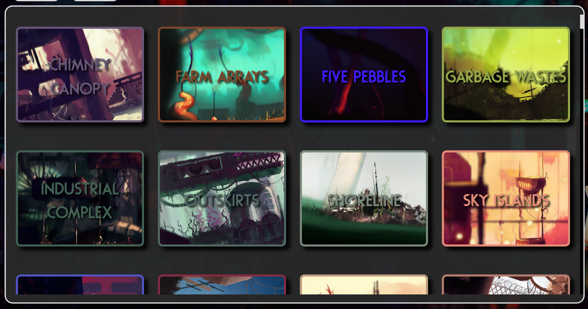

This is the region list, here you can choose what threat theme you want to play with. You can scroll through the list of regions with the scroll wheel, or by dragging the scroll bar to the right. To select a region, simply click on the region button that you want to mix.

### Menu Buttons

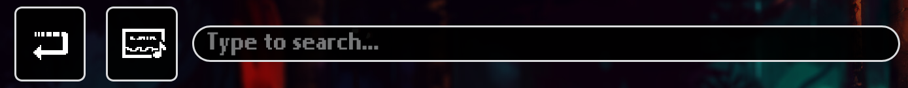

These are the menu buttons for the selection screen. From left to right, they are:
1. Back button: This button brings you back to the home screen.
2. Preview music toggle: This turns on and off the Preview music that plays when you hover over a region.
3. Search box: This allows you to search for regions by name.

### Search Filters

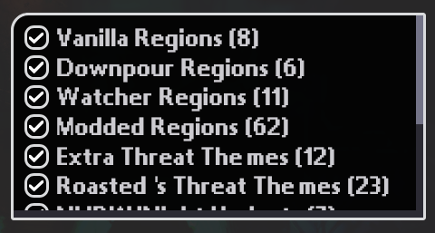

This allows you to filter what regions from certain mods/DLCs are displayed. Click on the checkbox next to a mod/DLC name to show or hide regions in that category. You can also view your favorited regions here, but that will be covered in more detail later.

### Region Info

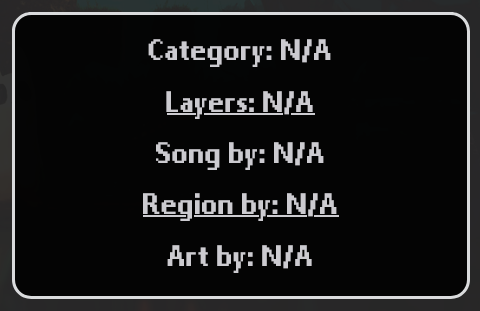

This will display information about the hovered region, such as what category it's in, how many layers the threat theme has, and who made the song, region & art.

### Favorite Regions

To favorite a region, hover over it and click the small heart in the top-left corner of the region button, that region will then be added to your favorites. To see the regions that you have favorited, uncheck everything in the "Search Filters" section, except for "Favorites". Your favorited regions are saved, even if you leave the webpage and come back.

## Music screen

Let's say you chose Outskirts. You'll then be brought to this region's "music screen".

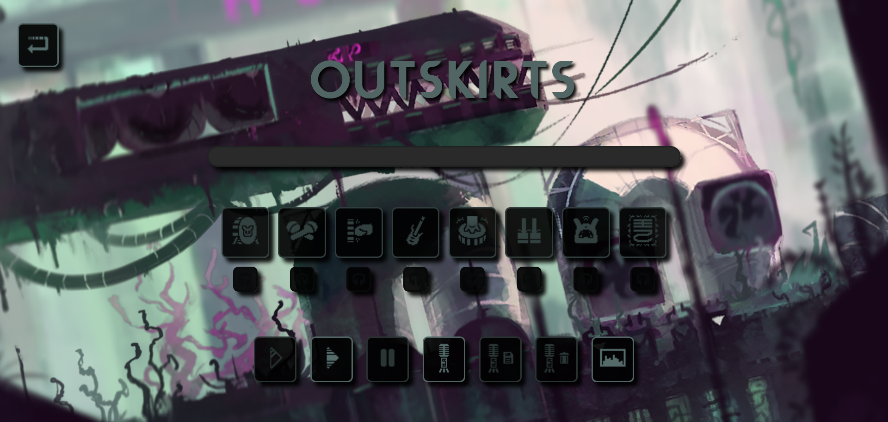

In the top left, you'll find the exit button, which will bring you back to the selection screen. Everything under the title of the region will be what you use to create your mixes. You'll also find that, when you begin playing music, a visualizer will appear and start moving in the background. Its visibility is toggleable via a button in the row of buttons towards the bottom, which I will cover in more detail later.

## Progress Bar

The progress bar represents the duration of the threat theme. It will automatically begin once you start the song, and reset when the song loops. Use it to learn when certain layers of the threat theme will begin playing to create stronger mixes!

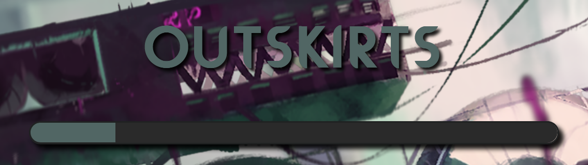

## Layer Buttons

This row of buttons represents each individual layer of your region's threat theme. Each button has an icon to help you understand what sound each button is representing. Beneath each large button (also called a "layer button"), is a smaller button with an icon representing headphones. These are called "solo buttons". 

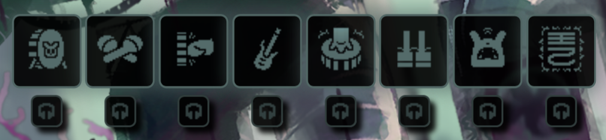

To simply go over what clicking each button will do, clicking a layer button will either mute or unmute the sound that it is representing (**after the start button has been clicked!**). Hitting a solo button will solo out whichever layer you want to have playing by itself. Clicking the solo button again will un-solo the layer that you've chosen and unmute any other layers that were playing beforehand. 
For instance, if I have the kick (scug drum), bass (guitar), and arps (piano) playing, when I hit the solo button under the arps button, both the kick and bass layers are muted so that only the arps are audible. Clicking that same solo button again will unmute the kick and the bass.

## General Control Buttons

Below the layer buttons, you'll find another row of buttons which provide you with greater control over your mix. From the left to right, the first three buttons control how the song plays, the next three allow you to record your mixes, and the final button is a simple toggle for the visualizer that runs in the background.

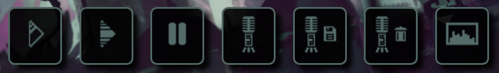

Here's how each button is used:

### 1. Start Button (Glass Play Icon)

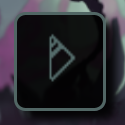

Before the song begins, you have the option to choose which layers you want to start off with. In order for this button to work, you must have at least 1 layer pre-selected. This is done by clicking on the layer buttons that you want to pre-select, causing them to enlarge to signify that they're active. Once you've chosen all of your layers, you can then click the start button to begin the threat theme. The layers that you've pre-picked will now be audible. Again, **you must click the start button to begin the song before anything can play!**

### 2. Play All Button (Stripped Play Icon)

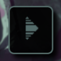
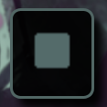

Alternatively to the start button, you can also click the play all button to begin the song with every layer active at once. If the threat theme is active and is currently playing, this button will change icons and become a stop or "end all" button. When clicked at any point, the song will cease and completely reset. The button will then change back to its "play all" state, and you can then either press it again or pre-select layers and use the start button.

### 3. Pause/Resume Button (Pause/Resume Icon)

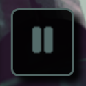 
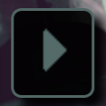

Clicking the pause button will halt the song without ending it. The progress bar and visualizer will cease movement as well. This also extends to the recording feature that you may have active, temporarily stopping it without effecting the resulting mp3 file. Although the song is paused, you can still mute, unmute, and solo layer buttons as you please (use this to your advantage to really get creative with your mixes!). After pausing the song, the pause button will become a resume button and, as you could guess, will resume the song once clicked.

### 4. Start Recording Button (Mic Icon)

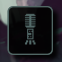
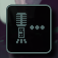
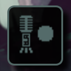

Pressing this button will activate this webpage's recorder, which allows you to record your mixes and then export them as an mp3 file. The recorder only picks up audio made by the page and no other audio sources; so not your microphone or external tabs/programs making noise. When the recorder is active, this button's icon will gain an ellipsis next to the microphone to show that recording is in progress. If you press this button before the song starts, the button icon will gain a large circle next to the microphone and the recorder will then be queued, meaning it will activate as soon as the song starts.

### 5. Save Recording Button (Mic + Floppy Disk Icon)

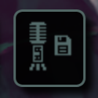

Pressing this button will transfer whatever the recorder picked up into an exportable mp3 file. You'll be prompted to enter the name of your file before it's automatically downloaded onto your computer. This file can then be used and shared (hopefully) wherever you please.

### 6. Delete Recording Button (Mic + Trash Bin Icon)

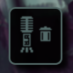

When pressed, the recording that's currently active will be discarded. A new recording can then begin afterwards, given there's no other recordings currently running. This button will also cancel a queued recording if the song hasn't started yet.

### 7. Visualizer Toggle (Canvas w/ Waves Icon)

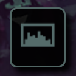
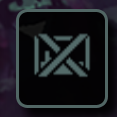

Lastly, the visualizer toggle can turn the visualizer moving in the background on or off. When on, the button icon will be how it is normally, representing audio waves enclosed in a canvas. When off, the button icon will be crossed out to signify the visualizer not being active.

That wraps up about everything that you need to know to use this webpage to its fullest. You have the tools to mix and match the layers of your favorite threat themes as you please, so I hope you enjoy using Threatmixer!